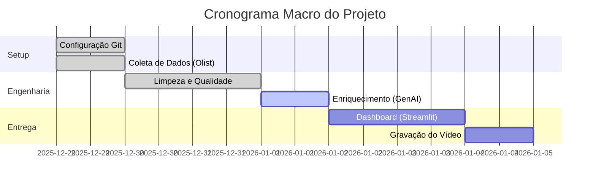

# Planejamento do Projeto

## Metodologia

Este projeto segue uma abordagem Ágil, com entregas iterativas focadas em: Engenharia, Qualidade, Enriquecimento com IA e Visualização.

## Kanban Board

### 📋 To Do (A Fazer)

- [ ] Desenvolver App Streamlit
- [ ] Gravar vídeo de apresentação
- [ ] Escrever documentação final

### 🚧 Doing (Em Progresso)

- [x] Implementar Validação de Dados (Great Expectations)

### ✅ Done (Feito)

- [x] Leitura e Interpretação do Case Técnico
- [x] Criar Pipeline de Ingestão de Dados (ETL)
- [x] Configuração do Ambiente e Repositório
- [x] Definição da Arquitetura (Colab + Streamlit)
- [x] Download e Análise Inicial da Base Olist

